# Team4-construction-supplier-management
# Assignment #2
# Construction Material Supplier Management Web Application

A web-based platform for managing construction material suppliers and procurement activities.

**Group 4**
- Dau Thuy Dung — D11505807@mail.ntust.edu.tw
- 黃晴 — M11505502@mail.ntust.edu.tw

---

## Website Organization Chart

```mermaid
graph TD
    A[🏠 Homepage / Landing Page] --> B[Supplier Directory]
    A --> C[Quote Request & Comparison]
    A --> D[Order Management]
    A --> E[Delivery Tracking]
    A --> F[Document Vault]
    A --> G[User Account]

    B --> B1[Search & Filter Suppliers]
    B --> B2[Supplier Profile Page]
    B --> B3[Preferred Suppliers List]

    C --> C1[Send RFQ to Suppliers]
    C --> C2[Compare Quotes Side-by-Side]
    C --> C3[RFQ Status Tracking]

    D --> D1[Create Purchase Order]
    D --> D2[Order Dashboard]
    D --> D3[Order Status Updates]

    E --> E1[Delivery Status View]
    E --> E2[Delay Notifications]
    E --> E3[Proof of Delivery]

    F --> F1[Upload Documents]
    F --> F2[Expiry Alerts]
    F --> F3[Search Documents]

    G --> G1[Login / Register]
    G --> G2[Profile Settings]
    G --> G3[Role Management]

    style A fill:#4CAF50,color:#fff,stroke:#2E7D32
    style B fill:#2196F3,color:#fff,stroke:#1565C0
    style C fill:#2196F3,color:#fff,stroke:#1565C0
    style D fill:#FF9800,color:#fff,stroke:#E65100
    style E fill:#FF9800,color:#fff,stroke:#E65100
    style F fill:#9C27B0,color:#fff,stroke:#6A1B9A
    style G fill:#9E9E9E,color:#fff,stroke:#616161

    style B1 fill:#BBDEFB,color:#0D47A1,stroke:#1565C0
    style B2 fill:#BBDEFB,color:#0D47A1,stroke:#1565C0
    style B3 fill:#BBDEFB,color:#0D47A1,stroke:#1565C0
    style C1 fill:#BBDEFB,color:#0D47A1,stroke:#1565C0
    style C2 fill:#BBDEFB,color:#0D47A1,stroke:#1565C0
    style C3 fill:#BBDEFB,color:#0D47A1,stroke:#1565C0
    style D1 fill:#FFE0B2,color:#BF360C,stroke:#E65100
    style D2 fill:#FFE0B2,color:#BF360C,stroke:#E65100
    style D3 fill:#FFE0B2,color:#BF360C,stroke:#E65100
    style E1 fill:#FFE0B2,color:#BF360C,stroke:#E65100
    style E2 fill:#FFE0B2,color:#BF360C,stroke:#E65100
    style E3 fill:#FFE0B2,color:#BF360C,stroke:#E65100
    style F1 fill:#E1BEE7,color:#4A148C,stroke:#6A1B9A
    style F2 fill:#E1BEE7,color:#4A148C,stroke:#6A1B9A
    style F3 fill:#E1BEE7,color:#4A148C,stroke:#6A1B9A
    style G1 fill:#F5F5F5,color:#212121,stroke:#616161
    style G2 fill:#F5F5F5,color:#212121,stroke:#616161
    style G3 fill:#F5F5F5,color:#212121,stroke:#616161
```

---

## Color Legend — Implementation Priority

| Color | Priority | Features |
|-------|----------|----------|
| 🟢 Green | Priority 1 — Build first | Homepage / Landing Page |
| 🔵 Blue | Priority 2 | Supplier Directory, Quote Request & Comparison |
| 🟠 Orange | Priority 3 | Order Management, Delivery Tracking |
| 🟣 Purple | Priority 4 | Document Vault |
| ⚫ Gray | Priority 5 — Build last | User Account & Auth |

---

## Team Responsibilities

| Section | Feature | Responsible |
|---------|---------|-------------|
| Supplier Directory | Search & Filter, Profile Page, Preferred List | Dau Thuy Dung |
| Quote Request | Send RFQ, Compare Quotes, RFQ Status | Dau Thuy Dung |
| Order Management | Create PO, Order Dashboard, Status Updates | 黃晴 |
| Delivery Tracking | Status View, Delay Notifications, Proof of Delivery | 黃晴 |
| Document Vault | Upload, Expiry Alerts, Search | Dau Thuy Dung |
| User Account | Login/Register, Profile, Role Management | 黃晴 |
| Homepage | Landing Page Design | 黃晴 |